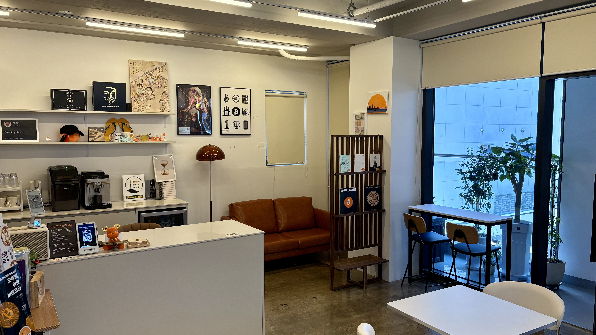
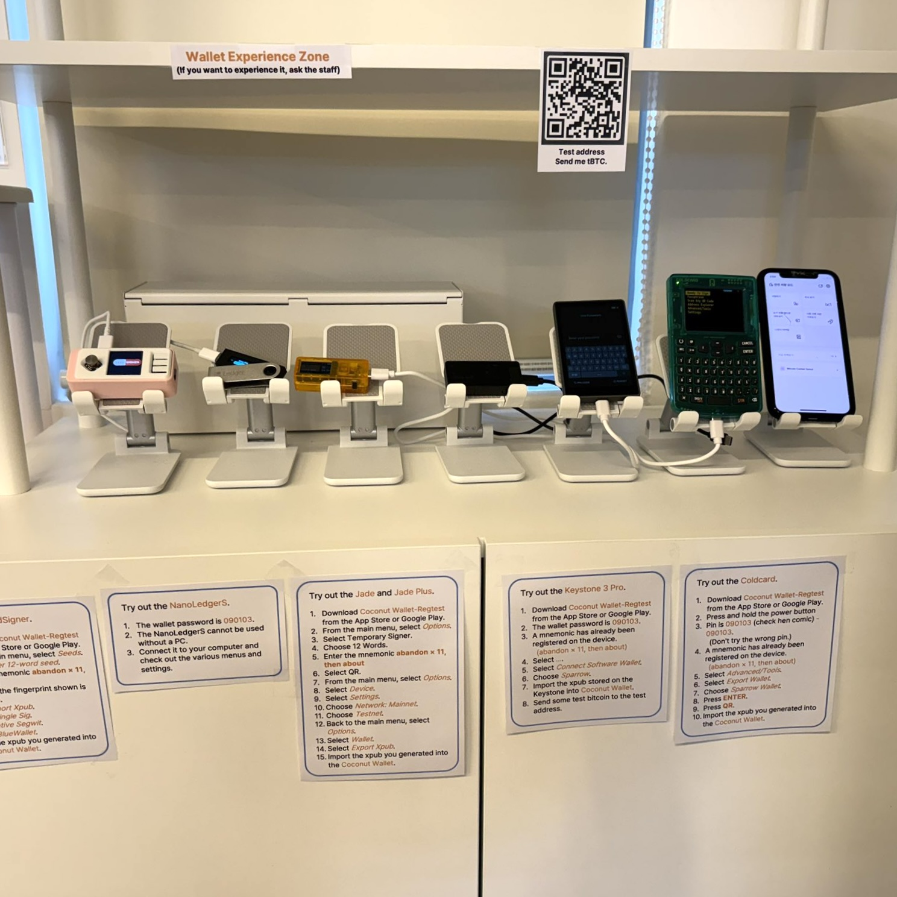

<div align="center">
  <a href="https://bitcoincenterseoul.com/ko">
    <picture>
      <source media="(prefers-color-scheme: dark)" srcset="web/public/brand/bcs-horizontal-color-dark.png" />
      
    </picture>
  </a>

# Bitcoin Center Seoul

**비트코인을 배우고, 만나고, 직접 경험하는 공간.**

서울 마포의 비트코인 센터 서울 · Bitcoin Center Seoul, Mapo, Seoul

[웹사이트](https://bitcoincenterseoul.com/ko) · [English](https://bitcoincenterseoul.com/en) · [방문 안내](https://bitcoincenterseoul.com/ko/visit) · [방문 후기](https://bitcoincenterseoul.com/ko/reviews)

</div>

[](https://bitcoincenterseoul.com/ko/about)

강의를 듣고, 책을 읽고, 지갑을 직접 다뤄보는 곳. 이 저장소는 센터의 공간과 활동을 소개하는 한국어·영어 웹사이트와 콘텐츠 관리 도구를 담고 있습니다.

<table>
  <tr>
    <td width="50%" valign="top">
      <a href="https://bitcoincenterseoul.com/ko/programs"></a>
      <p><strong>함께 배우는 시간</strong><br /><a href="https://bitcoincenterseoul.com/ko/programs">강의와 밋업 일정 →</a></p>
    </td>
    <td width="50%" valign="top">
      <a href="https://bitcoincenterseoul.com/ko/collection"></a>
      <p><strong>직접 경험하는 비트코인</strong><br /><a href="https://bitcoincenterseoul.com/ko/collection">전시·체험 둘러보기 →</a></p>
    </td>
  </tr>
</table>

[개발 안내](web/README.md) · [디자인 기준](web/DESIGN.md) · [배포 안내](DEPLOY.md) · [운영 절차](docs/security/operations.md)

## 사이트에서 만나는 것들

| 영역 | 내용 |
| --- | --- |
| [센터 소개](https://bitcoincenterseoul.com/ko/about) | 실제 공간 영상과 사진으로 둘러보는 라운지·서재·전시 |
| [프로그램](https://bitcoincenterseoul.com/ko/programs) | 강의·밋업 일정과 행사별 상세 안내 |
| [현장 스케치](https://bitcoincenterseoul.com/ko/journal) | 센터에서 열린 행사와 모임을 사진과 글로 소개 |
| [전시·체험](https://bitcoincenterseoul.com/ko/collection) | 도서·작품 갤러리와 단계별 하드웨어 지갑 체험 안내 |
| [방문 안내](https://bitcoincenterseoul.com/ko/visit) | 지도, 주소, 운영시간, 연락처와 현재 운영 상태 |
| [방문 후기](https://bitcoincenterseoul.com/ko/reviews) | 방문자의 이야기를 사진·본문·원문 링크로 소개 |
| [공지사항](https://bitcoincenterseoul.com/ko/notices) | 운영 소식과 센터 이용 안내 |
| 관리자 | 행사·현장 스케치·방문 후기·공지·도서·작품 편집, 사진 업로드와 운영 예외 설정 |

한국어·영어와 라이트·다크 모드를 지원합니다. 실제 센터 사진, 일관된 카드와 타이포그래피, 움직임 줄이기 설정을 고려한 모션을 사용합니다.

운영 상태는 서울 시간을 기준으로 계산합니다. 일요일을 포함해 매일 운영하되 법정공휴일과 임시휴무를 반영하며, 관리자가 예외 운영을 설정할 수 있습니다. 운영시간 이후의 밋업도 상태에 반영합니다.

## 기술 구성

| 구분 | 사용 기술 |
| --- | --- |
| 런타임 | Node.js 24 · npm |
| 웹 | Next.js · React · TypeScript |
| 스타일·모션 | Tailwind CSS · Motion |
| 데이터·이미지 | SQLite · better-sqlite3 · Sharp |
| 운영 구성 | 단일 호스트 · nginx · systemd · 수동 배포 |

정확한 런타임 버전은 [web/.nvmrc](web/.nvmrc), 의존성 버전은 [web/package.json](web/package.json)과 잠금 파일을 기준으로 합니다. 센터 소개, 프로그램, 전시, 방문 후기와 공지를 한국어와 영어로 보여 줍니다.

## 로컬에서 시작하기

새 사이트의 작업 디렉터리는 `web/`입니다. nvm을 사용한다면 다음으로 런타임과 의존성을 준비합니다.

```sh
cd web
nvm install
nvm use
npm ci
```

이어서 [개발 안내의 로컬 검토 절차](web/README.md#로컬-검토)에 따라 데이터 사본을 준비하고 검사·빌드·실행합니다. 검토용 데이터와 설정은 Git에 포함되지 않으므로 저장소 복제만으로 데이터가 준비되지는 않습니다.

검토 서버의 공개 화면은 `http://127.0.0.1:3102/ko`, 관리자 화면은 `http://127.0.0.1:3102/ko/admin`입니다.

## 저장소 구조

| 위치 | 역할 |
| --- | --- |
| `web/` | 새 공개 사이트, 관리자 화면, 테스트와 운영 템플릿 |
| `public/` | 센터 사진과 정적 자산 |
| `docs/design/` | 디자인·콘텐츠·자산 참고 자료 |
| `docs/security/` | 인증·프록시·백업·복구 기준 |
| `src/`, `server.js`, `database.js` | 보존 중인 기존 Vite·React·Express 애플리케이션 |

## 운영과 문서 관리

배포는 [수동 배포 안내](DEPLOY.md)를 따릅니다. 루트의 기존 배포 스크립트는 새 서비스에 사용하지 않으며 GitHub Actions도 사용하지 않습니다. 데이터 백업과 복구, 관리자 인증과 프록시 설정은 [운영 절차](docs/security/operations.md)에 모아 두었습니다.

환경변수 파일, 데이터베이스, 운영 업로드는 커밋하지 않습니다. 임시 체크포인트·리뷰·인계 문서는 Git에서 제외되는 `.local/docs-archive/`에 보관합니다.
